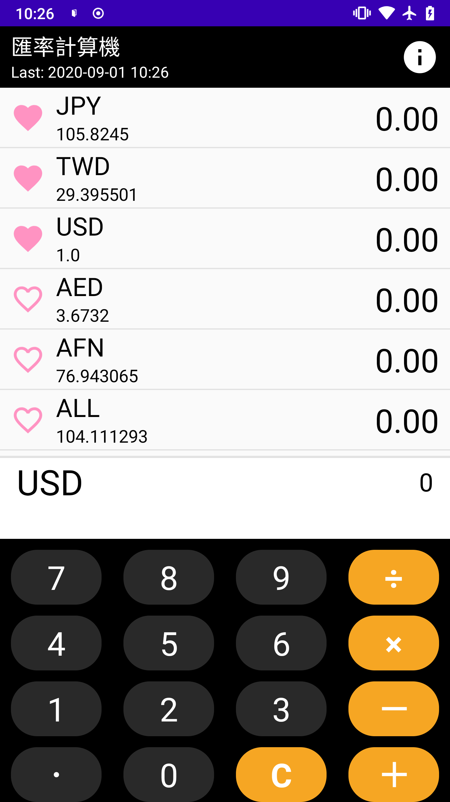
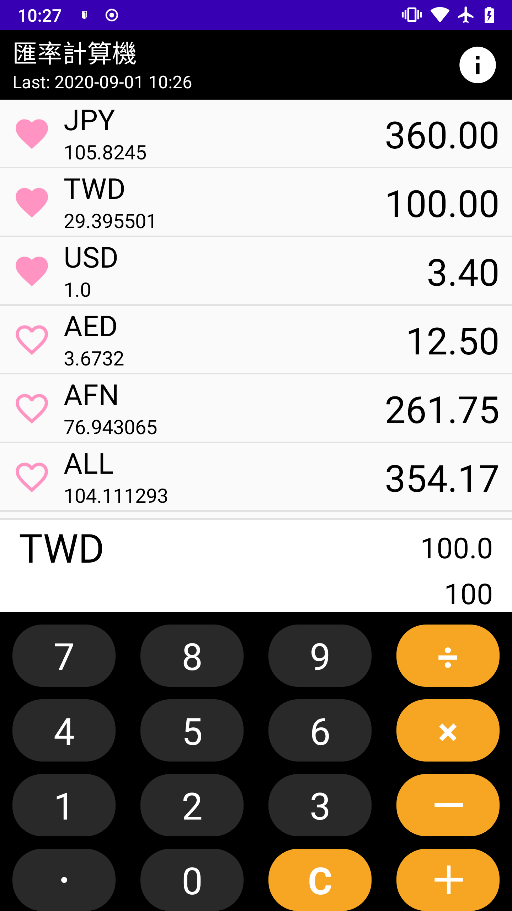
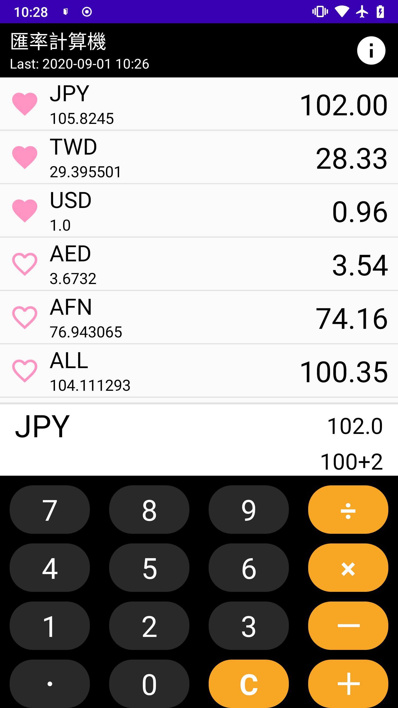
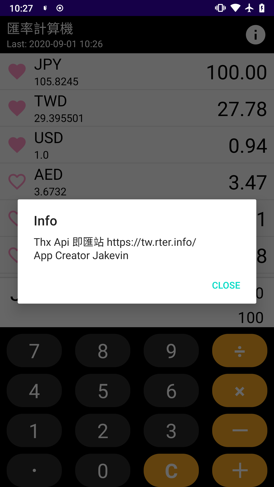

Currency Exchange Rates
==========
Easy to Exchange, Calculator + Exchage List

### Download

### Screenshots
 

### Functional
- Calculate and Exchange
- Max Decimal Point：6
- Select your Main currency and auto exchange all of other currency
- Pin your favorite currencies

### How to use

1. Pin or Unpin favorite currency
2. Click currency to change Main currency
3. Click exchange result to change Decimal point lenght (Default:2 Max:6)

### Tools
1. icon creator：https://www.designevo.com/tw/apps/logo/
2. Currency Rate Api :https://currencylayer.com and
https://tw.rter.info
3. Android icon creator：https://romannurik.github.io/AndroidAssetStudio/icons-launcher.html
