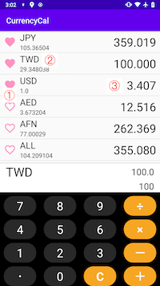

# Currency Exchange Rates

Easy to Exchange, Calculator + Exchage List

### Functional
- Get Newest Currency Rates from： https://currencylayer.com/documentation
- Calculate and Exchange
- Max Decimal Point：6
- Select your Main currency and auto exchange all of other currency
- Pin your favorite currencies

### How to use
1. Pin or Unpin favorite currency
2. Click currency to change Main currency
3. Click exchange result to change Decimal point lenght (Default:2 Max:6)